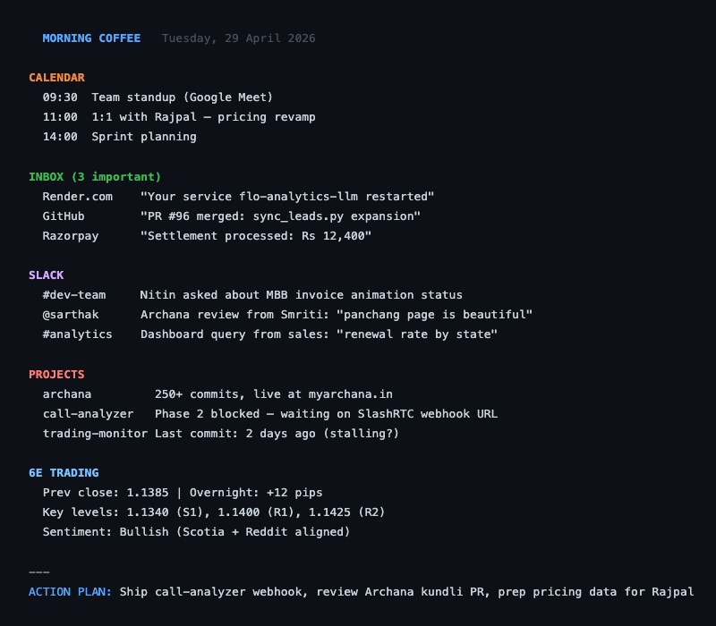
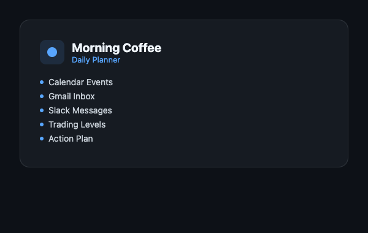

<p align="center">
  
</p>

# Morning Coffee

**Your entire day, planned in one command.**

<p align="center">
  
</p>

<p align="center">
  
</p>

## Why

Every morning starts the same way -- check Calendar, scan Gmail, read Slack, look at charts, then try to mentally piece together what matters today. Morning Coffee runs one command and delivers a structured briefing: today's meetings, action items with full context (who said what, why it matters, exactly what to do), a time-blocked day plan, and optionally 6E futures trading levels with a game plan. Everything in one place, before the first sip.

## How

1. Type `/morning-coffee` or say "plan my day" in Claude Code
2. Four data sources are queried in parallel: Calendar, Gmail, Slack, project memory
3. Items needing action TODAY are surfaced with full context and concrete next steps
4. A time-blocked day plan maps every action item to a specific slot
5. If trading is mentioned, 6E levels and a game plan are appended automatically
6. Newsletters, promos, and noise are collapsed into a `+N skipped` line

```
morning coffee                # Full briefing without trading
morning coffee with levels    # Briefing + 6E trading levels and game plan
plan my day                   # Same as morning coffee
```

## Features

| Category | Feature | Detail |
|----------|---------|--------|
| Calendar | Today + week ahead | Events for today plus next 4 days in a table |
| Gmail | Actionable inbox scan | Unread/starred/important from last 24h with full context per item |
| Slack | DMs + mentions | Unread messages from last 24h |
| Projects | Memory cross-reference | Reads project memory files for blockers and deadlines |
| Action Items | Rich context | Each item: bold name, 2-3 lines of who/what/history, concrete "Action:" line |
| Action Items | Noise collapse | Newsletters, promos, birthdays collapsed into `+N skipped` line |
| Day Plan | Time-blocked schedule | Maps every action item to a specific slot with sub-tasks |
| Day Plan | Day-of-week awareness | Monday: easing in, Wednesday: aggressive, Friday: close loops |
| Trading | 6E levels table | All pivot levels sorted high-to-low with distance and cluster info |
| Trading | Bias + game plan | VWAP, Delta, RSI, multi-sentence bias read, entry conditions, disqualifiers |
| Resilience | Graceful degradation | Skips unavailable sources with a note, continues with what works |

## Tech

| Component | Technology |
|-----------|------------|
| Runtime | Claude Code slash command skill |
| Calendar | Google Calendar MCP |
| Email | Gmail MCP |
| Messaging | Slack MCP |
| Trading data | Sierra Chart .scid via HTTP from Windows PC |
| Levels engine | Python trading-monitor (`personal/trading-monitor/`) |
| Time zone | IST (hardcoded) |

## Architecture

```
morning-coffee/
├── SKILL.md                  # Skill definition: data sources, workflow, output format
├── README.md                 # This file
├── logo.png                  # Skill icon
├── docs/
│   ├── morning-coffee-card.png    # Skill card screenshot
│   └── morning-coffee-output.png  # Sample output screenshot
└── input/                    # Reference frames and screenshots
```

The skill is a Claude Code agent definition -- no separate server or database. It orchestrates MCP tools (Calendar, Gmail, Slack) and the trading-monitor Python engine in parallel, cross-references all sources, and formats the combined output into a structured morning briefing.

## Status

| Item | State |
|------|-------|
| Google Calendar integration | Live |
| Gmail inbox scan + noise filtering | Live |
| Slack DM + mention scan | Live |
| Project memory cross-reference | Live |
| Time-blocked day plan generation | Live |
| 6E trading levels (optional) | Live |
| Week-ahead table | Live |
| Day-of-week awareness | Live |
| Graceful degradation | Live |

---

Built by [Sarthak Goel](https://github.com/sarthakgoel31)
